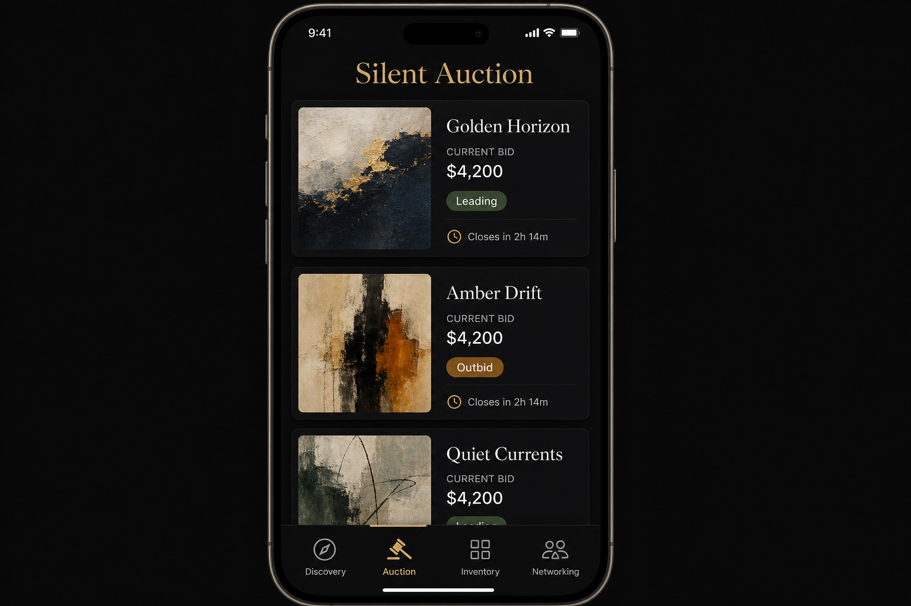
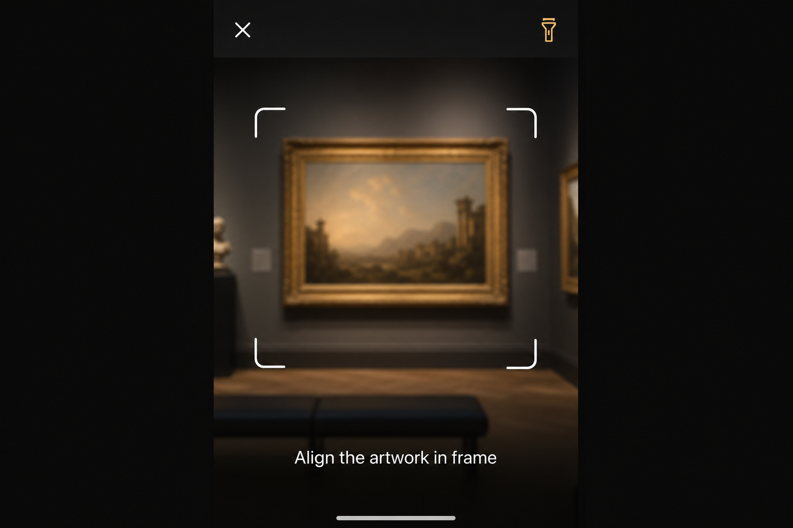
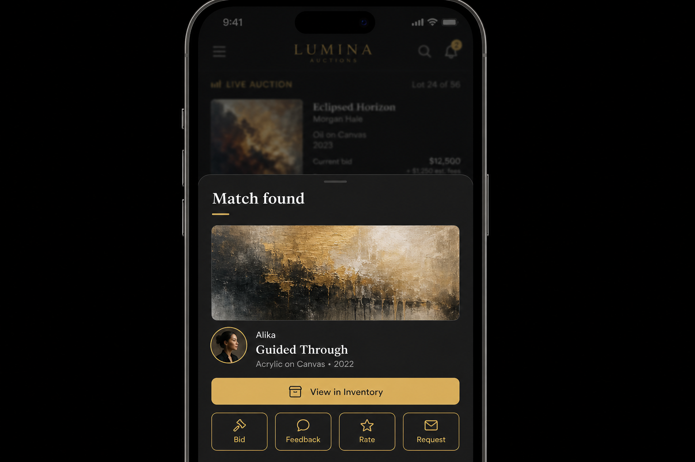
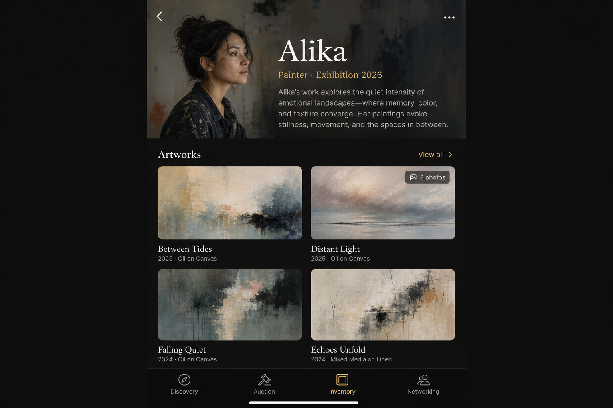
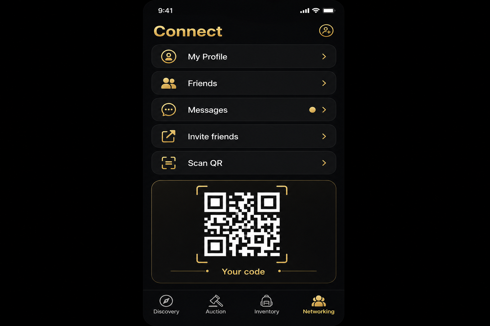

# Exhibition Auction App — UI/UX Design Specification

**Status:** Design & mockups (pre-implementation)  
**Date:** 2026-05-12  
**References:** Premium auction apps (Sotheby’s-style catalog timelines, live bid clarity), art marketplaces (Artsy-style artist-first browse, saved interest, rich artwork pages), museum companion apps (ArtLens / Rijksmuseum-style camera-first discovery, contextual sheets after recognition).

---

## 1. Design principles

| Principle | Application |
|-----------|-------------|
| **Quiet luxury** | Dark or warm-neutral base, one accent (brass / soft gold / deep teal), high contrast for prices and CTAs. |
| **Art-first** | Imagery dominates; typography supports; chrome stays thin. |
| **Progressive disclosure** | Scanner → quick match sheet → full lot in Inventory/Auction; never dump everything at once. |
| **Trust & clarity (silent auction)** | Always show current high bid, minimum next bid, time window, and “your bid status” without noise. |
| **Permission respect** | Request camera only when entering Discovery; explain *why* (“Identify works on the wall”). |
| **Touch targets** | Minimum ~44×44 pt for nav and primary actions; bottom nav for thumb reach on large phones. |
| **Accessibility** | WCAG AA contrast on text; scalable type; haptics optional for bid confirmation; screen reader labels on scanner states. |

---

## 2. Information architecture

```
App root
├── Discovery      (camera / scanner → match → sheet → deep link)
├── Auction        (silent lots: active, your bids, closing order)
├── Inventory      (Artists → Artist detail → Artwork detail [multi-image])
└── Networking     (Profile, Friends, Chat, Invite, Scan QR)
```

**Bottom navigation (fixed):** 4 tabs + optional center “Scan” affordance (industry pattern: museum apps emphasize scan in center; auction apps keep browse first—**recommendation:** keep 4 equal tabs; Discovery tab opens scanner as default sub-state to avoid a fifth icon).

---

## 3. Tab workflows

### 3.1 Discovery (exhibition scanner)

**Goal:** Point camera at a work on the wall → identify match in **inventory** → show artist + artwork in a **modal / bottom sheet** → user can jump to Inventory (same artwork) for rating, feedback, bid, purchase request.

| Step | Screen | Behavior |
|------|--------|----------|
| D1 | **Scanner** | Full-bleed camera; subtle corner brackets; hint: “Frame the artwork”; optional torch toggle; gallery upload fallback. |
| D2 | **Analyzing** | Lightweight overlay; indeterminate progress; cancel. |
| D3 | **No match** | Friendly empty state; “Try closer light” / “Search inventory manually”. |
| D3′ | **Match** | Bottom sheet (~60% height) or card: hero image (prefer “main” angle), title, artist name + small avatar, year/medium if known, **View in Inventory** (primary), **Dismiss**. |
| D4 | **From sheet** | Secondary chips: Rate, Feedback, Bid, Request purchase — *or* single primary + “More actions” to reduce clutter. |

**Matching (design note for engineering later):** Image similarity / on-device ML / QR on label—**UI** assumes async match with clear states; offline queue optional in roadmap.

---

### 3.2 Auction (silent)

**Goal:** Silent auction hub; a lot **surfaces automatically** when it receives activity (e.g. first bid opens visibility or moves to “Active”).

| Area | Content |
|------|---------|
| **Active** | Horizontally scrollable “live strip” or vertical feed: artwork thumb, title, **current bid**, **your status** (Leading / Outbid / Watching), time left. |
| **Feed semantics** | New bids bump lot toward top (activity-sorted), with subtle “just updated” treatment. |
| **Lot row tap** | Full-screen lot: image carousel (multi-image folder), estimate range, bid field, confirm sheet. |
| **Rules** | Short link: “How silent bidding works”. |

Visual reference: auction-house apps emphasize **lot clarity** and **timelines**; avoid carnival colors—use status pills (Leading = soft green tint, Outbid = warm amber).

---

### 3.3 Inventory (artists & artworks)

**Goal:** Browse by **artist**; each artist has profile + list/grid of **artworks**; each artwork supports **multiple images** (angles).

| Level | UI |
|-------|-----|
| **Artists** | Search + filter; list rows: portrait, name, location/role line, work count. |
| **Artist detail** | Bio block, links, **Artworks** grid (2 columns), optional “At exhibition” badge. |
| **Artwork detail** | Hero carousel (dots + swipe), metadata, long description, actions: Bid, Request purchase, Rate, Feedback (same actions as post-scan path). |

**Multi-image rule:** Carousel order = `(Main)` first if present, then numeric / alphabetical; pinch-zoom on hero optional phase 2.

---

### 3.4 Networking

**Goal:** Invite friends, chat, profile, **scan QR to add friend**.

| Screen | Features |
|--------|----------|
| **Hub** | Cards: My profile, Friends, Messages, Invite, Scan QR. |
| **Profile** | Avatar, display name, bio, privacy toggles. |
| **Friends** | Pending / Active; QR code display + “Scan to add”. |
| **Chat** | Thread list → conversation; read receipts optional phase 2. |
| **Invite** | Share sheet / link / exhibition code. |

---

## 4. Cross-cutting flows

```
Scan match sheet ──primary──► Artwork detail (Inventory) ──► Bid / Feedback / Rate / Purchase request
                                    │
                                    └──► Same lot in Auction tab (if active)
```

**Deep linking:** `inventory/artist/:id`, `inventory/artwork/:id`, `auction/lot/:id`, `networking/chat/:id`, `discovery` (scanner).

---

## 5. Component library (high level)

- **AppBar** (minimal; context title only on sub-pages).
- **BottomNav** (4 items: Discovery, Auction, Inventory, Networking).
- **BottomSheet** (match, bid confirm, filters).
- **LotCard** / **ArtworkCard** (image ratio 4:5 or 3:4 consistent).
- **ImageCarousel** (artwork angles).
- **BidStepper** (increment silent bids).
- **StatusPill** (Leading, Outbid, Watching, Closing soon).
- **EmptyState** (illustration + one CTA).
- **ScannerOverlay** (brackets + copy).

---

## 6. Visual system (tokens — draft)

- **Background:** `#0E0E0F` (primary), surface `#1A1A1C`, elevated `#242428`.
- **Text:** primary `#F4F2ED`, secondary `rgba(244,242,237,0.65)`.
- **Accent:** `#C9A962` (brass) for primary buttons and key numbers.
- **Success / warning (bids):** muted green `#6FAF8A`, amber `#D4A574`.
- **Radius:** 12–16px cards; full pill for chips.
- **Type:** Display / titles: high-contrast serif or editorial sans; UI: geometric sans (e.g. DM Sans / similar stack in implementation).

---

## 7. Mockups (generated)

High-fidelity PNGs live in `docs/mockups/`. Use for review before implementation.

| File | Description |
|------|-------------|
| [`mockups/mockup-01-auction-silent.png`](mockups/mockup-01-auction-silent.png) | Auction tab: silent lots, status pills, bottom nav. |
| [`mockups/mockup-02-discovery-scanner.png`](mockups/mockup-02-discovery-scanner.png) | Discovery: camera viewfinder UI. |
| [`mockups/mockup-03-match-sheet.png`](mockups/mockup-03-match-sheet.png) | Post-scan match bottom sheet + CTAs. |
| [`mockups/mockup-04-inventory-artist.png`](mockups/mockup-04-inventory-artist.png) | Inventory: artist profile + artwork grid + multi-photo hint. |
| [`mockups/mockup-05-networking-hub.png`](mockups/mockup-05-networking-hub.png) | Networking: profile, friends, chat, QR. |











---

## 8. Implementation phases (after sign-off)

1. Shell + routing + bottom nav + theme tokens.  
2. Inventory (data model: artist → artworks → image[]).  
3. Auction (silent lot list + detail + bid flow).  
4. Discovery (camera permission + UI states; match stub → real matcher).  
5. Networking (profile, QR placeholder, chat scaffold).  
6. Polish: motion, haptics, empty states, a11y audit.

---

## 9. Open decisions (product)

- **Single vs multi-auction:** MVP assumes one exhibition auction event.  
- **Auth:** Guest vs account for bidding (legal/compliance).  
- **Purchase request vs bid:** Separate pipelines in UI copy.  
- **Recognition tech:** QR on wall labels vs CV matching (affects D2 copy).

---

*End of design spec. Implementation should not start until mockups are reviewed.*
